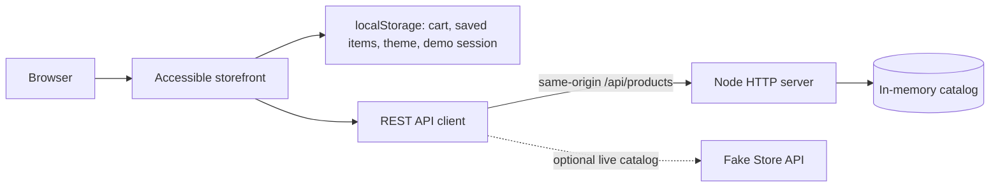

# RabTech Academy Internship Capstone

A mobile-first, accessible commerce dashboard built as a learning capstone for the Full Stack Web Development internship.

## Project map

```text
client/              Accessible storefront and dashboard UI
  index.html         Semantic app shell, catalog, cart dialog, help form
  styles.css         Design tokens, themes, responsive layout
  js/                API client, catalog state and UI controller
server/              Node HTTP API with in-memory CRUD catalog
docs/                Architecture, audit worksheet, evidence and screenshots
tests/               Manual acceptance checklist and test scaffolding
```

## Architecture



## Boundaries

The client renders the interface, manages filters and user preferences, and calls `/api/products`. `client/js/api.js` owns network and demo fallback behavior. The server exposes a small JSON REST API and owns catalog CRUD. The server stores data in memory, so catalog edits reset when the process restarts. Cart contents and theme preference stay in browser `localStorage`.

## Run locally

Requires Node.js 18 or newer. No third-party packages are required.

```sh
node server/index.js
```

Open <http://localhost:3000>. To use the external Fake Store API instead of the local API, visit <http://localhost:3000/?source=external>. The client falls back to bundled demo data if a request fails.

## Deployment

Pushing to `main` publishes the client to GitHub Pages through `.github/workflows/pages.yml`. On Pages, the catalog loads from Fake Store API and catalog edits persist in that browser's `localStorage`. For full-stack local use, `node server/index.js` serves the client and same-origin REST API. The server's catalog is in memory and resets when it restarts. This is an internship learning demo, not production commerce software.

## First vertical slice

Load the catalog from the API, show loading and failure states, search/filter/sort products, create/rename/delete inventory through the local CRUD API, add to a persistent cart, and adjust quantities in the cart dialog. The demo sign-in is a localStorage toggle and checkout is a mock button; neither sends credentials or collects payment information.

## Accessibility and responsive behavior

The interface uses landmarks, heading hierarchy, visible keyboard focus, labeled inputs, status announcements, reduced-motion support, and responsive grid/flex layouts. A manual checklist lives in `tests/acceptance.md`; the detailed audit notes and priorities are in `docs/accessibility-audit.md`.

## Further work

See `docs/architecture.md` for the data flow, extension points, and production gaps. Authentication is simulated in the interface; this demo is not a production commerce service.
